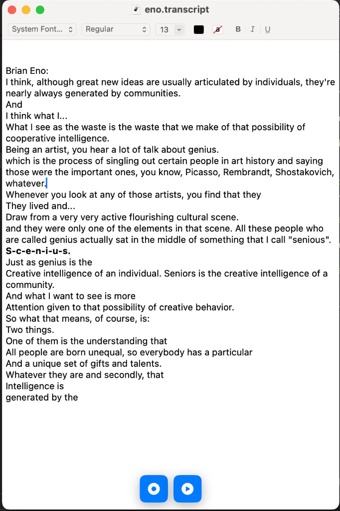
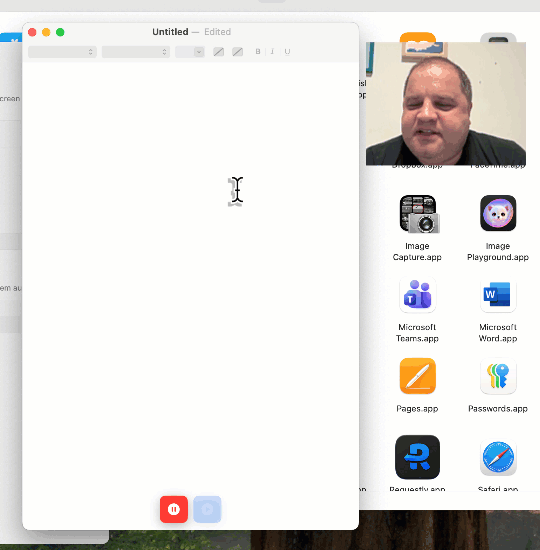

# Moonshine Note Taker

Transcribe any speech on your Mac-**completely privately**, with no connection to the cloud. Record yourself, capture Zoom meetings, play back podcasts or videos, or drag in audio and video files. Edit as you go, then export as a document, formatted text, audio, or SRT captions.

**Free and open source.**

---

## Get the app

- **Download:** [note-taker.moonshine.ai/download](https://note-taker.moonshine.ai/download)
- **Mac App Store:** [apps.apple.com/us/app/moonshine-note-taker/id6758634869](https://apps.apple.com/us/app/moonshine-note-taker/id6758634869?mt=12)

---

## Screenshots & video

**[▶ Watch the intro video](https://www.youtube.com/watch?v=fKZ8br8FSVQ)**

| | |
|:---:|:---:|
| **Transcript window** — Edit with formatting tools; record and play from the bottom controls. | **Live dictation** — Speech appears in the document as you talk. |
|  |  |

---

## What you can do

- **Record live** — Hit Record and speak; your words appear in the document. You can also capture **system audio**: Zoom calls, browser tabs, podcasts, or anything else playing on your Mac.
- **Transcribe files** — Drag audio or video files into the document to transcribe them.
- **Edit while transcribing** — Fix mistakes and add formatting as text streams in.
- **Playback with sync** — Play back recorded audio and see the corresponding text highlighted as it plays.
- **Export** — Save your work as:
  - A **Moonshine Note Taker document** (transcript + audio)
  - **Formatted text** (RTF) for use in other apps
  - **Audio** (WAV)
  - **Captions** (SRT) with timings

Everything runs **on your Mac**; no data is sent to the internet.

---

## Getting started

1. **System audio (optional)** — To transcribe Zoom, browser audio, or other system sound, grant **Screen Recording** (or system audio) permission when prompted. You may need to **quit and reopen** the app for it to take effect.
2. **Microphone (for voice)** — When you tap **Record**, allow microphone access if asked.
3. **Record** — Start recording; speech is transcribed in real time. You can keep editing and formatting while it runs.
4. **Playback** — Use playback to hear the recording and see the text sync.
5. **Save / export** — Use **File → Save** for the full document, or the export options for text, audio, or SRT.

---

## Requirements

- **macOS 15.0** or later  
- Apple Silicon or Intel Mac

---

## For developers

### Build from source

1. Clone the repo and open `MoonshineNoteTaker.xcodeproj` in Xcode.
2. The app depends on the **Moonshine** Swift package (Moonshine Voice) for on-device transcription. Resolve package dependencies in Xcode.
3. The app expects a **models** directory (e.g. `MoonshineNoteTaker/models`) with the Moonshine Voice model assets. Ensure the model files are present and referenced correctly for your setup.
4. Build and run the **Moonshine Note Taker** target.

### Tech overview

- **Transcription:** [Moonshine Voice](https://github.com/moonshineai/moonshine-voice) (on-device, no cloud).
- **System audio capture:** ScreenCaptureKit (macOS).
- **App:** Swift/SwiftUI, document-based (`.transcript` bundle), with export to RTF, WAV, and SRT.

### License

This project is licensed under the MIT License. See [LICENSE.txt](LICENSE.txt) for the full text.

---

Copyright © 2026 Moonshine AI
